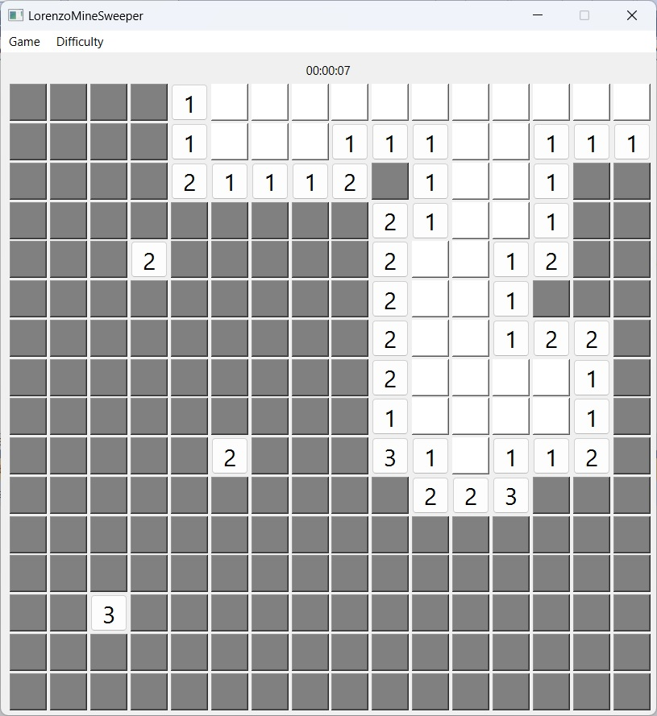

# Lorenzo's Minesweeper Game

This is a cross-platform Minesweeper game based of the C++ version and developed using the Qt library.

## Game Features

- The main user interface is implemented using a main window (an object derived from the `QMainWindow` class), and the Minesweeper grid is directly drawn as filled rectangles in the client area of the main window.
- It provides a difficulty adjustment feature where the beginner level consists of a 9x9 grid with 10 mines, and the intermediate level consists of a 16x16 grid with 40 mines. The difficulty can be adjusted through the main window menu.
- If a square is uncovered and the surrounding 8 squares do not contain mines, the adjacent 8 squares will automatically be uncovered.
- Basic game functionalities include the ability to restart the game and display success or failure messages.
- The game utilizes a Vista-style dialog box as a wizard to guide the user in selecting the game difficulty upon program startup.

## Planned Features

- Implementation of game timing and scoring functionality.

## Installation and Running

1. Clone or download this repository to your local machine.
2. Open the project file using a Qt compiler.
3. Compile and run the game.

## Core Algorithm Code

This is implemented using a recursive algorithm, but of course, you can also simulate it with a stack. Anyway whichever method you use, be careful to set a large enough stack space size.
```cpp
if (row < 0 || row >= fieldSize || col < 0 || col >= fieldSize)
    return; // Out of bounds

if (!minefield[row][col]->text().isEmpty() || visited[row][col])
    return; // Already revealed or visited

visited[row][col] = true;
revealedTiles++;

int minesNearby = 0;
for (int dx = -1; dx <= 1; dx++) {
    for (int dy = -1; dy <= 1; dy++) {
        int nx = row + dx, ny = col + dy;
        if (nx >= 0 && nx < fieldSize && ny >= 0 && ny < fieldSize && minefieldData[nx][ny] == 1) {
            minesNearby++;
        }
    }
}

if (minesNearby == 0) {
    // ...
    for (int dx = -1; dx <= 1; dx++) {
        for (int dy = -1; dy <= 1; dy++) {
            floodFill(row + dx, col + dy);
        }
    }
} else {
    // ...
}
```

## Screenshots




## System Requirements

- Operating System: Cross-platform compatible
- Compiler: Qt compiler, with at least Qt 5 library support

## Contributing

Contributions of code and improvement suggestions are welcome. Please create an issue to discuss your ideas before submitting a pull request to contribute your code.

## Author

[Adolofo Lorenzo Cristóbal Pérez](https://github.com/voidregreso)

## License

This project is licensed under the [MIT License](LICENSE).